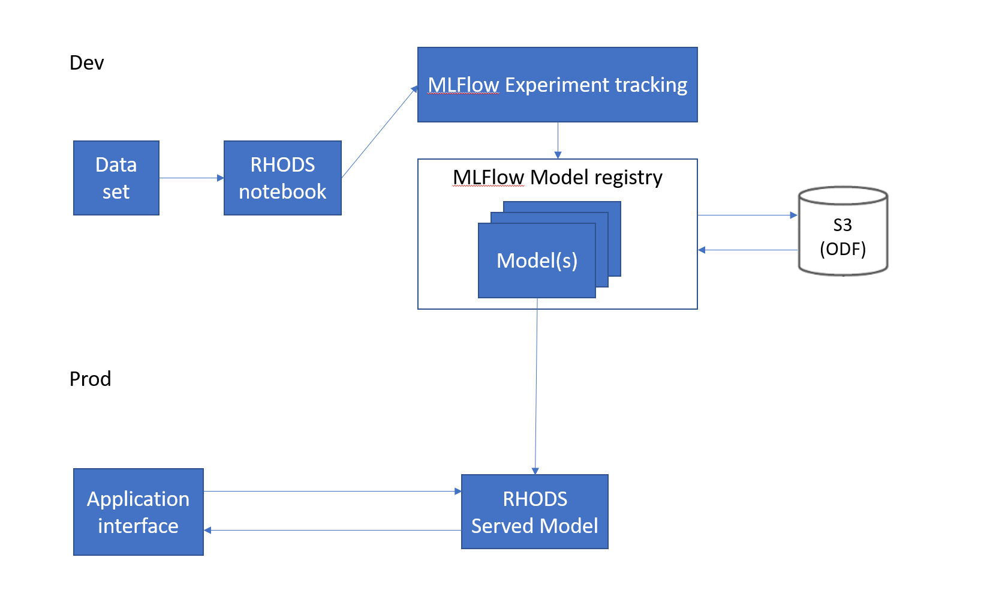

# Credit Fraud Detection Demo using MLFlow and RHODS
[Source](https://github.com/red-hat-data-services/credit-fraud-detection-demo)

## Pre-requisites:
- Have [RHODS](/getting_started_rhods) running in a cluster
- Have [MLFlow](/tools_and_applications_mlflow) running in a cluster
- 

## Architecture
This demo uses RHODS and MLFlow to build and end-to-end MLOps platform where we can: 

- Build and train models in RHODS
- Track and store those models in MLFlow
- Automatically deploy models to production (using RHODS serving) when the MLFlow model stage changes
- And observe how the model performs in production.

The architecture looks like this:

For S3 we use ODF (OpenShift Data Foundation) according to the MLFlow guide, but it can be replaced with another storage.  
The monitoring component uses Prometheus and Grafana.

## Demo
Start by finding your route to MLFlow. You will need it to send any data to MLFlow.

- Go to the OCP Console as a Developer
- Select your mlflow project 
- Press Topology 
- Press the mlflow-server circle 
- Go to the Resources tab 
- Press mlflow-server under Services 
- Look at the Hostname and mlflow-server Port.

Then we will create a new Jupyter from RHODS, this is where we will build and train our model.

Make sure to add the environment variable `MLFLOW_ROUTE=http://<route-to-mlflow>`. In this case it will be `MLFLOW_ROUTE=http://mlflow-server.mlflow.svc.cluster.local:8080`.  

When inside Jupyter, pull down this repo from GitHub: [https://github.com/red-hat-data-services/credit-fraud-detection-demo](https://github.com/red-hat-data-services/credit-fraud-detection-demo)  
It will contain everything you need to train and later run your model.